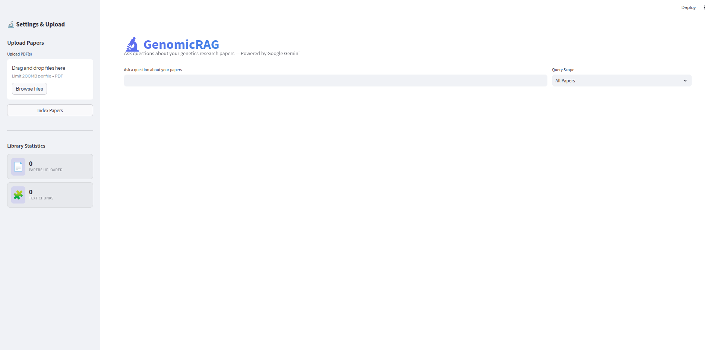
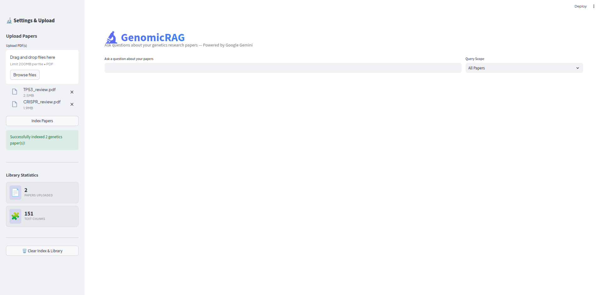
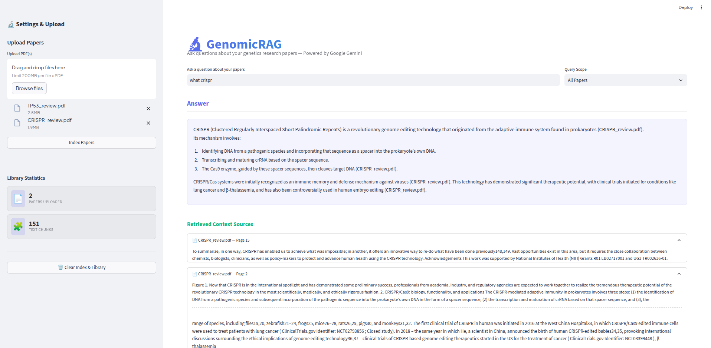
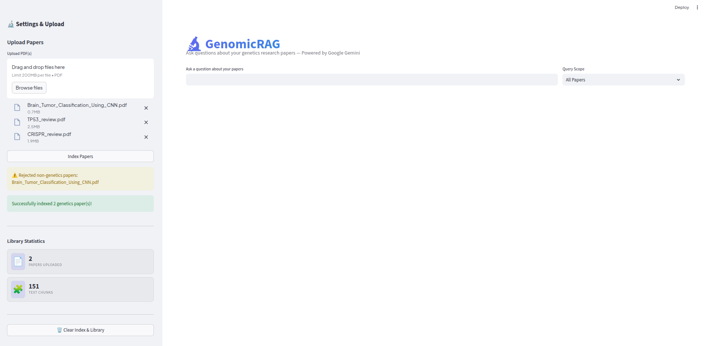

# GenomicRAG — Genomic Research Assistant

[](https://genomicrag-zz5yfjcmrtf7eofadshk5u.streamlit.app/)

Go to website by clicking this: [Streamlit Web App](https://genomicrag-zz5yfjcmrtf7eofadshk5u.streamlit.app/)

GenomicRAG is a domain-specific Retrieval-Augmented Generation (RAG) web application designed to allow researchers and genetics students to upload academic research papers (PDFs) and ask natural language questions. The application parses the files, verifies they are related to genetics/genomics, indexes their core text (excluding the bibliography lists), and generates answers grounded in the papers' content along with precise citations.

---

## How It Works

GenomicRAG operates through a multi-stage pipeline:

1. **Domain Verification**: Whenever a PDF is uploaded, a sample snippet is analyzed by Google's Gemini LLM (`gemini-flash-latest`) to ensure the document is related to genetics, genomics, molecular biology, or hereditary diseases. Non-relevant documents are automatically rejected to preserve the database's integrity.

2. **Text Cleaning & Reference Trimming**: 
   - Raw text is cleaned of IEEE or publisher headers, footers, and license watermarks.
   - A sequence parsing filter detects the start of the **References** or **Bibliography** section in the PDF and truncates the remaining pages. This prevents bibliographical references from clogging the vector store and polluting retrieved sources.

3. **Chunking & Vector Embeddings**: The text is split into overlapping chunks of 2000 characters using LangChain's `RecursiveCharacterTextSplitter`. These chunks are converted into dense vector embeddings using Google's `gemini-embedding-001` model via the Gemini Embeddings API, mapping each chunk into a high-dimensional semantic vector space.

4. **Numpy Vector Store**: The embeddings are stored as a `numpy` matrix and serialised to disk as a lightweight `.pkl` pickle file. At query time, cosine similarity is computed between the query embedding and all stored vectors using fast matrix operations — no external database or C-extension library required, making it fully portable and deployable on any platform.

5. **Query Expansion & Hybrid RAG Retrieval**: When a query is entered, a custom `GenomicRetriever` translates general terms or abbreviations (like "BRCA") into specific synonyms and gene symbols (like "BRCA BRCA1 BRCA2 breast cancer gene") to retrieve the most semantically relevant text chunks. The retrieval depth is fully customizable via UI settings.

6. **Answer Synthesis**: The retrieved chunks are formatted and sent to the selected Google Gemini model along with the user's question, generating a complete answer only if supported by the context, in the user-selected format (Standard Detail, Large Format, or Concise Summary), accompanied by collapsible citation cards.

---

## Tech Stack & Core Libraries

- **Streamlit**
  Streamlit renders a sleek, interactive sidebar for PDF uploads, displays real-time database library statistics, provides a dropdown for narrowing search queries to specific files, and displays output responses and source citations within clean collapsible containers.

- **LangChain**
  LangChain serves as the main orchestration wrapper that chains together our document load, retrieval, and synthesis phases. It manages prompt templates and structures the overall retrieval flow through `RetrievalQA` to ensure context blocks are correctly retrieved and combined before invoking the Gemini model.

- **Numpy Vector Store**
  Instead of a native C-extension library like FAISS, the project uses a pure-Python cosine-similarity vector store backed by `numpy`. Document embeddings are stored as a normalised float32 matrix, and retrieval is performed via a simple matrix dot-product.

- **Google Gemini Embeddings (`gemini-embedding-001`)**
  Document chunks and user queries are converted into dense semantic vectors using Google's `gemini-embedding-001` embedding model.

- **Google GenAI API (Gemini)**
  The project utilizes Google's Gemini models (with support for `gemini-flash-latest`, `gemini-2.5-flash`, `gemini-pro-latest`, and `gemini-2.0-flash`) for fast, low latency, advanced reasoning capabilities.

- **PyPDF**
  PyPDF is employed in the background to handle the initial parsing and loading of raw PDF documents page by page.

- **Python-dotenv**
  Python-dotenv is used to manage local configuration and environment secrets securely.

---

## Features

GenomicRAG now includes advanced control and reliability optimizations:

- **⚙️ RAG Configuration Panel**: Custom settings inside the Streamlit sidebar:
  - **Gemini Model Selector**: Choose the model to run queries on (`gemini-flash-latest`, `gemini-2.5-flash`, `gemini-pro-latest`, `gemini-2.0-flash`).
  - **Detail Level**: Toggle answer formats (Standard Detail, Large Format (High Detail), or Concise Summary).
  - **Chunks per Sub-Query**: Slider controlling retrieval depth per sub-query (range 1-10).
  - **Max Combined Chunks**: Slider controlling the maximum unique chunks sent as context (range 2-25).
- **🔒 Rate-Limit Optimization**: Uses the high-quota `gemini-flash-latest` model (Gemini 1.5 Flash) by default for both domain verification and Q&A to bypass the restrictive 20 requests/day free tier quota limits of `gemini-2.5-flash`.
- **✍️ Anti-Truncation Answer Engine**: Migrated from legacy `RetrievalQAWithSourcesChain` to `RetrievalQA` to prevent regex splitting at model-generated citations, ensuring all answers complete with fully-formed sentences.

---

## Application Preview

### 1. Main Interface Overview


### 2. PDF Upload & Text Chunking


### 3. Factual Q&A with Sources


### 4. Non-Genetics Paper Rejection (Domain Guardrail)


---

## How to Set Up & Run Locally

1. **Navigate to the application folder**:
   ```bash
   cd genomicrag
   ```

2. **Activate the virtual environment**:
   ```bash
   source venv/bin/activate
   ```

3. **Provide your API Key**:
   Create a `.env` file containing your Gemini API key:
   ```env
   GOOGLE_API_KEY=your_gemini_api_key_here
   ```

4. **Launch the web application**:
   ```bash
   streamlit run app.py
   ```
